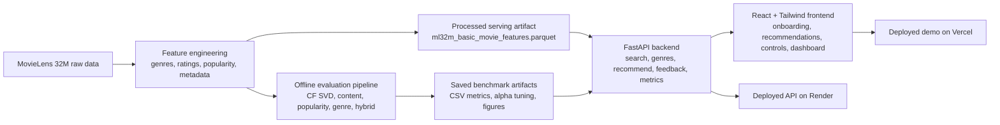
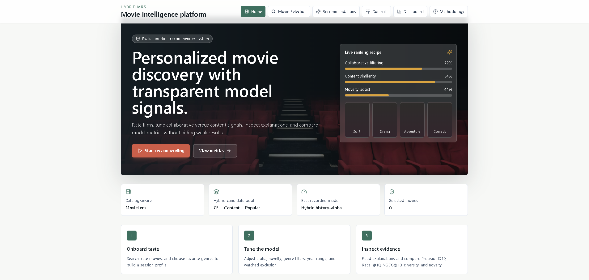
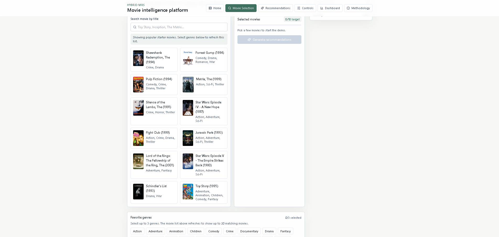
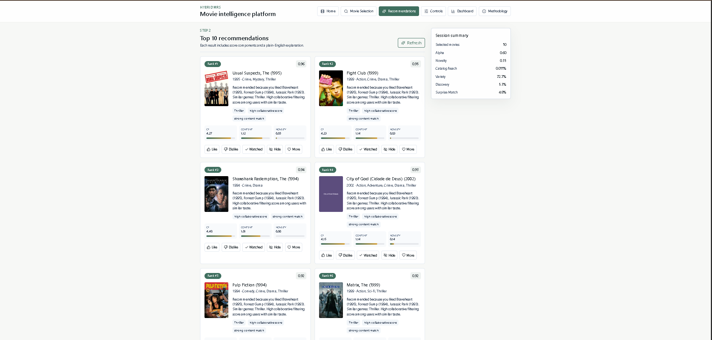
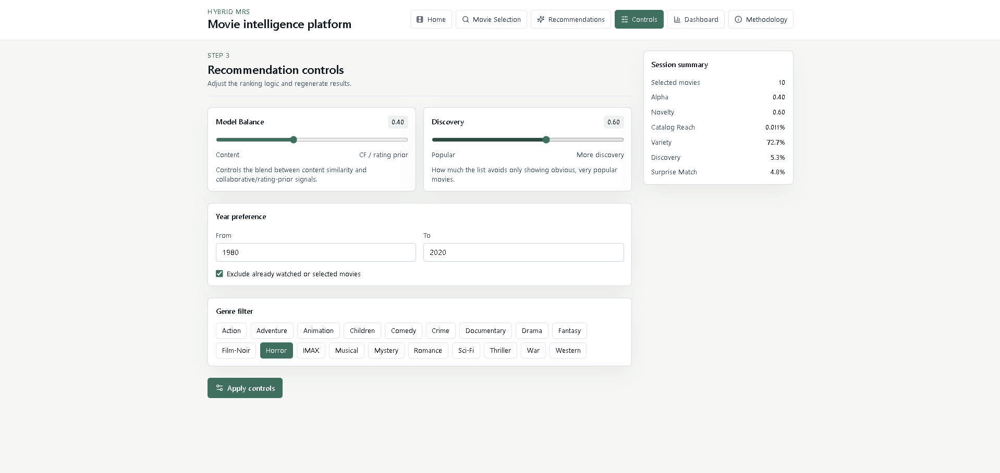
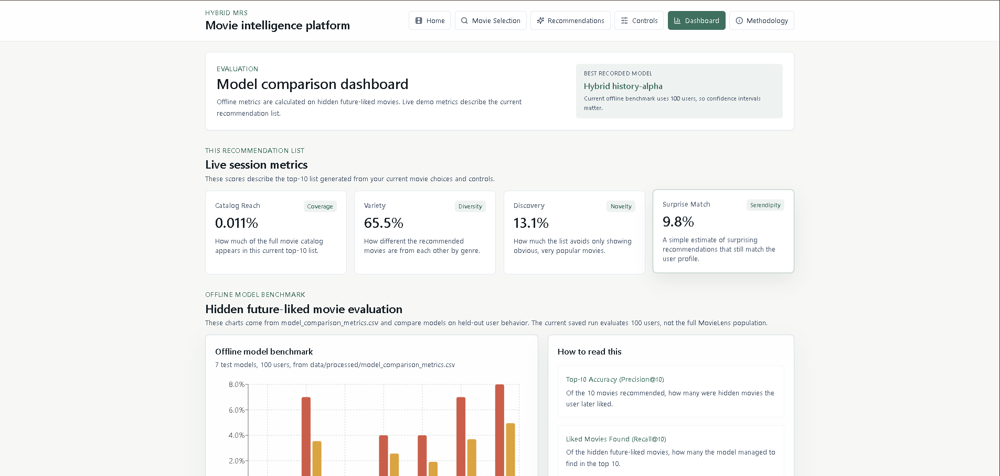
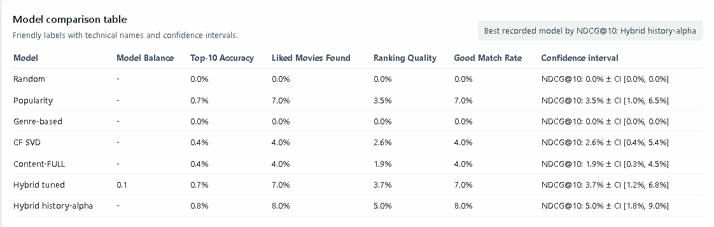
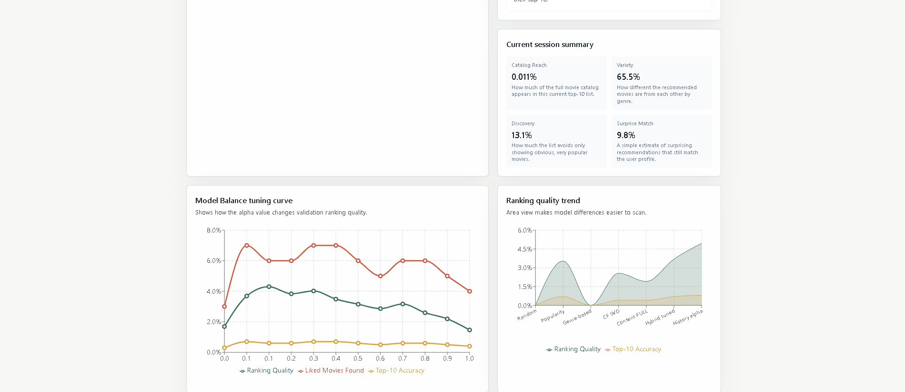
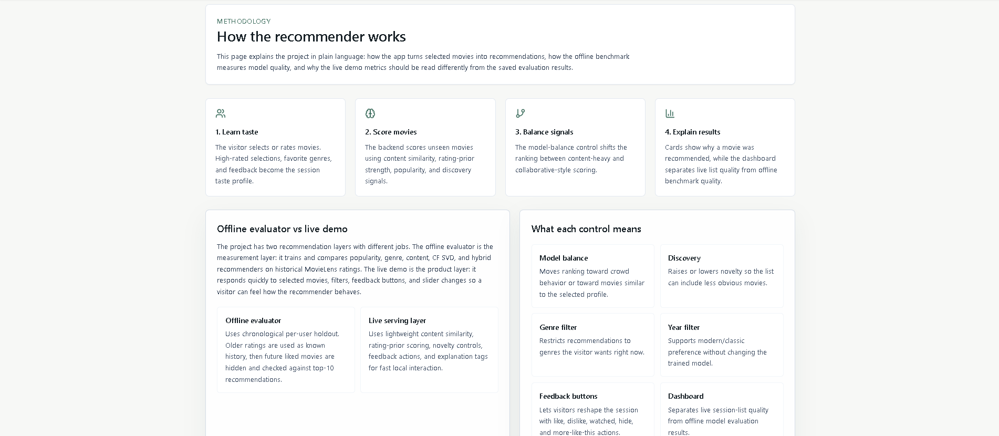

# Hybrid Movie Recommendation System


This project started as a recommender-systems exercise and gradually turned into a small full-stack movie recommendation demo. It uses MovieLens 32M for the offline evaluation work and a lightweight serving layer for the interactive app.

## Live demo

- Frontend: [https://hybrid-mv971m3l8-ssmind.vercel.app](https://hybrid-mv971m3l8-ssmind.vercel.app)
- Backend API: [https://hybridmrs.onrender.com](https://hybridmrs.onrender.com)
- Health check: [https://hybridmrs.onrender.com/health](https://hybridmrs.onrender.com/health)

## Why this project matters

I wanted this project to show more than a model notebook or a single metric screenshot. The useful part, at least for me, was building the pieces around the model too:

- a measurable offline evaluator instead of only a polished UI
- a user-facing product demo instead of only training scripts
- a clear distinction between benchmark metrics and live recommendation-list metrics
- explainable ranking signals so a reviewer can inspect why the system made each suggestion
- deployable frontend and backend services rather than a local-only prototype

That makes it a better portfolio piece because it touches the parts that usually show up in real work too: modeling, evaluation, serving, UI decisions, and explaining tradeoffs clearly.

## Architecture



## What this project includes

- Collaborative filtering baseline with Surprise SVD
- Content-based recommendation with engineered movie features
- Popularity, genre-based, and hybrid baselines for honest comparison
- Chronological per-user holdout evaluation with top-k ranking metrics
- Confidence intervals for Precision@10, Recall@10, NDCG@10, and Hit Rate@10
- FastAPI backend for search, recommend, feedback, and metrics
- React + Tailwind frontend with onboarding, recommendations, controls, dashboard, and methodology pages

## Prerequisites

Before running the project locally, make sure you have:

- Python `3.9+`
- Node.js `18+`
- `pnpm` or `npm` for the frontend

Optional:

- TMDB API key for expanded real poster coverage

## Project structure

```text
app/
  backend/    FastAPI recommendation API
  frontend/   React + Tailwind UI
data/
  processed/  metrics, poster metadata, engineered features
  raw/        MovieLens source files
src/          offline evaluation and feature engineering code
scripts/      utilities such as poster fetching
```

## Local setup

There are two dependency paths here:

- `requirements-api.txt` for the deployable FastAPI app
- `requirements.txt` for the full project, including offline training, notebooks, charts, and evaluation scripts

### Quick start for the demo

Backend in one terminal:

```bash
pip install -r requirements-api.txt
python scripts/run_backend.py
```

Frontend in a second terminal:

```bash
cd app/frontend
pnpm install
pnpm dev
```

Open:

```text
http://localhost:5173
```

### Full project setup

If you want to run the offline training and evaluation code as well:

```bash
pip install -r requirements.txt
```

### Backend smoke test

After the backend is running, you can verify the core API endpoints with:

```bash
python scripts/smoke_test_api.py
```

That script checks:

- `/health`
- `/genres`
- `/movies/search`
- `/metrics`

### Why the API has a slim requirements file

The serving API does not need the whole offline stack. In practice, `scikit-surprise`, notebooks, and plotting libraries are only used for training and evaluation, not for the deployed FastAPI service. Splitting those dependencies keeps local setup lighter and makes hosted deploys less fragile.

## Deployment

The cleanest split for this project is:

- frontend on Vercel
- backend API on Render

That fits the current codebase pretty naturally because the frontend is a Vite app and the backend is a standalone FastAPI service.

### Backend on Render

This repo now includes [render.yaml](render.yaml) for the API service.

Render expects Python web services to bind to `0.0.0.0` and the platform `PORT`, which is why the production start command uses:

```bash
uvicorn app.backend.main:app --host 0.0.0.0 --port $PORT
```

Recommended Render setup:

- Build command: `pip install -r requirements-api.txt`
- Start command: `uvicorn app.backend.main:app --host 0.0.0.0 --port $PORT`
- Health check path: `/health`

The official Render docs for FastAPI and Python web services are here:

- [Deploy a FastAPI App](https://render.com/docs/deploy-fastapi)
- [Render Web Services](https://render.com/docs/web-services)
- [Setting Your Python Version](https://render.com/docs/python-version)

### Frontend on Vercel

The frontend can be deployed from `app/frontend`. This repo now includes [app/frontend/vercel.json](app/frontend/vercel.json) so Vercel recognizes the Vite app more explicitly.

Before deploying, set:

- `VITE_API_BASE=https://your-render-api-url.onrender.com`

Then deploy the frontend directory as a Vite project.

Official Vercel references:

- [Vite on Vercel](https://vercel.com/docs/frameworks/frontend/vite)
- [Deploying to Vercel](https://vercel.com/docs/deployments/overview)

### Production checklist

Before calling it deployed, make sure:

- the Render service returns `200` from `/health`
- `VITE_API_BASE` points to the live backend URL
- CORS in `app/backend/main.py` includes your frontend domain
- `data/processed/ml32m_basic_movie_features.parquet`
- `data/processed/model_comparison_metrics.csv`
- `data/processed/movie_posters.csv`

are committed and available in the deployed repo

### One practical note

The local `scripts/run_backend.py` runner now works for both local use and simple hosted setups because it reads `HOST` and `PORT` from environment variables. For Render though, the direct `uvicorn ... --host 0.0.0.0 --port $PORT` command is still the clearest production setup.

## Portfolio release

Current portfolio tag:

- `v1.0-portfolio-demo`

This release is the first fully deployed portfolio version of the project, with:

- live frontend and backend links
- offline benchmark dashboard
- hybrid recommendation demo
- deployment-ready API setup
- README documentation for local run and hosted deployment

## API overview

```text
GET  /movies/search?query=
GET  /genres
POST /recommend
POST /feedback
GET  /metrics
GET  /monitoring
```

Example request:

```json
{
  "liked_movies": [1, 356, 4993, 7153],
  "alpha": 0.6,
  "novelty": 0.35,
  "top_k": 10
}
```

## Product flow

1. Movie onboarding: search, select, and rate movies, then choose up to 3 favorite genres.
2. Recommendations: view the top 10 movies with scores, explanations, and poster art.
3. Controls: adjust model balance, novelty, year range, genre filters, and watched exclusion.
4. Feedback loop: like, dislike, hide, mark watched, or ask for more like this.
5. Dashboard: inspect live-list metrics, offline benchmark results, alpha tuning, and model comparisons.

## Offline evaluation vs live demo

The project keeps two different concerns separate, and that distinction is intentional:

### Offline evaluator

The offline evaluation pipeline trains and compares:

- CF SVD
- Content-based
- Popularity
- Genre-based
- Hybrid recommenders

It uses chronological per-user holdout. Older ratings are treated as known history, future liked movies are hidden, and each model is scored on whether those hidden liked movies appear in the top 10.

Relevant item definition:

- test rating `>= 4.0`

The current saved benchmark in the repo uses `100` sampled users, so the dashboard confidence intervals should still be read as a small benchmark rather than a broad production claim. A better next step is to rerun the same pipeline at larger sample sizes and compare how stable the headline metrics stay.

### Evaluation sample-size check

One useful way to make the offline benchmark more credible is to rerun it at larger user counts and compare the best test result from each run.

You can generate that summary with:

```bash
python scripts/benchmark_sample_sizes.py --sample-sizes 100 500 1000
```

This writes:

```text
data/processed/evaluation_sample_size_summary.csv
```

Recommended summary table:

| Sample size | Precision@10 | Recall@10 | NDCG@10 | Hit Rate@10 | Runtime |
| --- | ---: | ---: | ---: | ---: | ---: |
| 100 | 0.008 | 0.080 | 0.050 | 0.080 | pending local rerun |
| 500 | pending | pending | pending | pending | pending |
| 1000 | pending | pending | pending | pending | pending |

The current 100-user row above reflects the best saved test row in `model_comparison_metrics.csv` (`Hybrid history-alpha`). The 500-user and 1,000-user rows should be filled with actual rerun results rather than guessed numbers.

### Live interactive demo

The web demo uses a lightweight serving layer so recommendations stay fast. It blends:

- content similarity
- rating-prior scoring
- novelty controls
- genre weighting
- negative feedback subtraction
- explanation tags

That keeps the interactive demo responsive without pretending it is the same thing as the offline benchmark.

In short:

- offline metrics answer "how did these models perform on hidden future-liked movies?"
- live demo metrics answer "what does this current recommendation list look like right now?"

They are related, but they are not interchangeable.

## Real poster metadata

The backend uses real poster URLs when this file exists:

```text
data/processed/movie_posters.csv
```

Expected columns:

```text
movieId,tmdbId,posterUrl,source
```

To expand poster coverage:

```bash
set TMDB_API_KEY=your_key_here
python scripts/fetch_tmdb_posters.py --limit 5000
```

## Screenshots

**1. Landing Page**  


**2. Movie Selection**  


**3. Selected Movies**  


**4. Recommendations**  


**5. Controls**  


**6. Dashboard**  


**7. Metrics**  


**8. Graphs**  


**9. Methodology**  


## Data sources

Primary benchmark:

- MovieLens 32M

Recommended enrichments:

- TMDB for posters, release metadata, runtime, and overview text
- IMDb non-commercial datasets for title metadata validation
- MovieLens Tag Genome 2021 for richer explanation and similarity features

## Limitations and next steps

Short-term improvements that fit the current version:

- expand offline evaluation beyond the current 100-user sample and keep a sample-size summary for 100, 500, and 1,000-user runs
- keep the offline/live distinction explicit in the UI and README so benchmark metrics and interactive demo metrics are not confused
- add a full model card covering data source, evaluation protocol, intended use, known biases, cold-start behavior, and non-goals
- add Docker containerization for the backend and frontend so local setup and deployment are reproducible
- add GitHub Actions CI for API tests, a frontend build check, and a lightweight smoke test
- extend the current request logging and `/monitoring` endpoint with simple rate limiting and more durable external monitoring if the project grows
- keep improving the evaluation section with cold-start analysis, popularity-bias discussion, and clearer reporting of diversity, novelty, and coverage metrics

Next-version product and platform work:

- add session-based and user-based persistence with PostgreSQL or Supabase for the deployed version
- store recommendation feedback in tables such as `users`, `user_likes`, `user_dislikes`, `watched_movies`, `recommendation_events`, and `feedback_events`
- track experiments with MLflow and keep saved model artifacts for reproducible offline runs
- move from a stateless demo toward a version where feedback can improve recommendations over time

Longer-term ML and retrieval work:

- expand the content model from genre-first recommendations to a richer mixed profile using genres, tags, year, and rating priors first, then add cast/director similarity through TMDB or IMDb metadata enrichment
- add richer tag-genome explanations and approximate nearest-neighbor retrieval

## License

This project is available under the MIT License. See [LICENSE](LICENSE).

